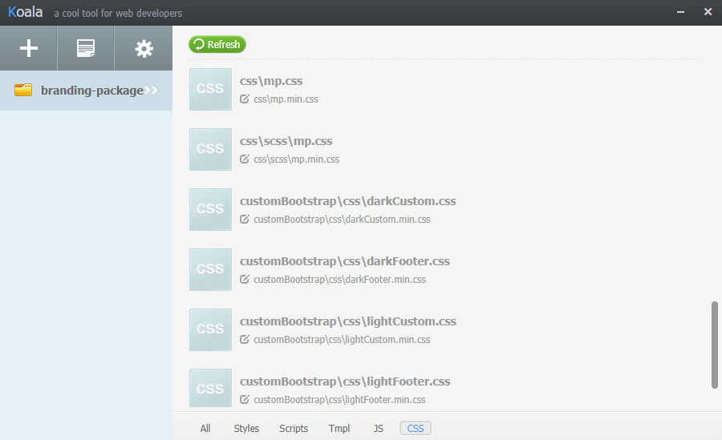

# Re-compile Branding Package with the use of Koala

Koala is a standalone GUI application that lets you compile easily Sass files and generate css files and their minified versions.

It also supports other pre-processor languages such as Compass, Less or CoffeeScript and supports the compilation and minification of js files.

**Step 1:** Download the Koala APP from the official website: [http://koala-app.com/](http://koala-app.com/)

Koala runs on Windows, Linux and Mac. Install it on Windows by following the Installation wizard steps. Koala can be directly used after installation.

**Step 2:** Open the Koala GUI and drag-and-drop the extracted branding-package folder into the window (or click on the + icon).


Now the `branding-package` project file structure appears:


Notice that by default the output path (grey files with edit icon) of the generated `.css` files is the same directory as the one of the `.scss` files.

We will change the output directories in the next step by using project settings (alternatively you can select each file and click on the &quot;edit&quot; icon to set its output path).

**Step 3:** Output the generated `.css` files into the `customBootstrap/css` folder (the output directory for custom bootstrap) and `css` folder (the output directory for `mp.css`), by using the project configuration settings.

Right-click on the `branding-package` project and choose &quot;Project Settings&quot; --\&gt; &quot;New settings&quot; --\&gt; For Sass&quot;.


Koala will create a `koala-config.json` file under you project directory. You can edit it and set custom settings.

Edit the `mappings` section as follows:

`// The mappings of source directory and output directory

&quot;mappings&quot;: [

{

&quot;src&quot;: &quot;customBootstrap/scss&quot;,

&quot;dest&quot;: &quot;customBootstrap/css&quot;

},

{

&quot;src&quot;: &quot;scss&quot;,

&quot;dest&quot;: &quot;css&quot;

}

],`

And now right-click on the project: `branding-package` and then `Reload` to reload the project with the modified `koala-config.json` configuration file.


The custom output directories are updated:


**Step 4:** Set the &quot;Auto Compile&quot; Option&quot; to automatically compile the files when they change.


**Step 5:** Compile the minified (compressed) versions: `darkCustom.min.css` and `mp.min.css`.

Open `koala-config.json` by navigating to: &quot;Project Settings&quot; --\&gt; &quot;Edit settings&quot;.

if you have .css in the ignores property, remove it:
```&quot;ignores&quot;: []```

Now all CSS files and their compile options appear when selecting the &quot;CSS&quot; tab on the bottom right of the window.



If not already defined so, set the output path of `darkCustom.css` to `darkCustom.min.css` in the same directory. Similarly set the minified output files for all .css files.

Lastly compile `darkCustom.css` to `darkCustom.min.css`. Select `darkCustom.css` then select the `yuicompress` Output Style, and click on the `Compile` button.


You&#39;re done! These steps should do all the job for the re-compilation of your custom branding package!


